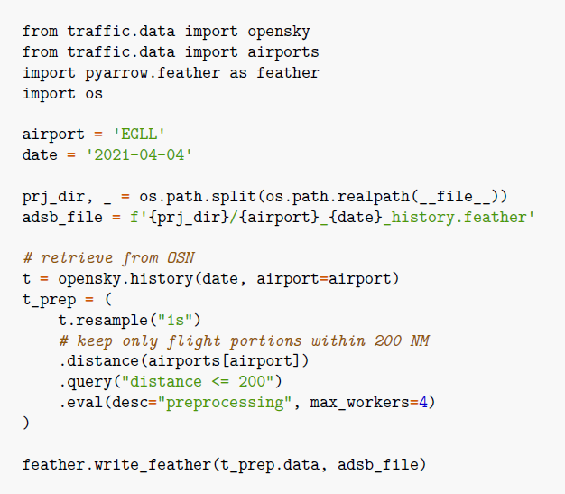
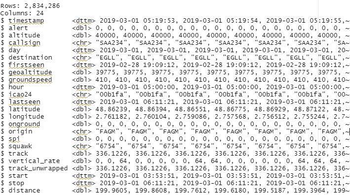
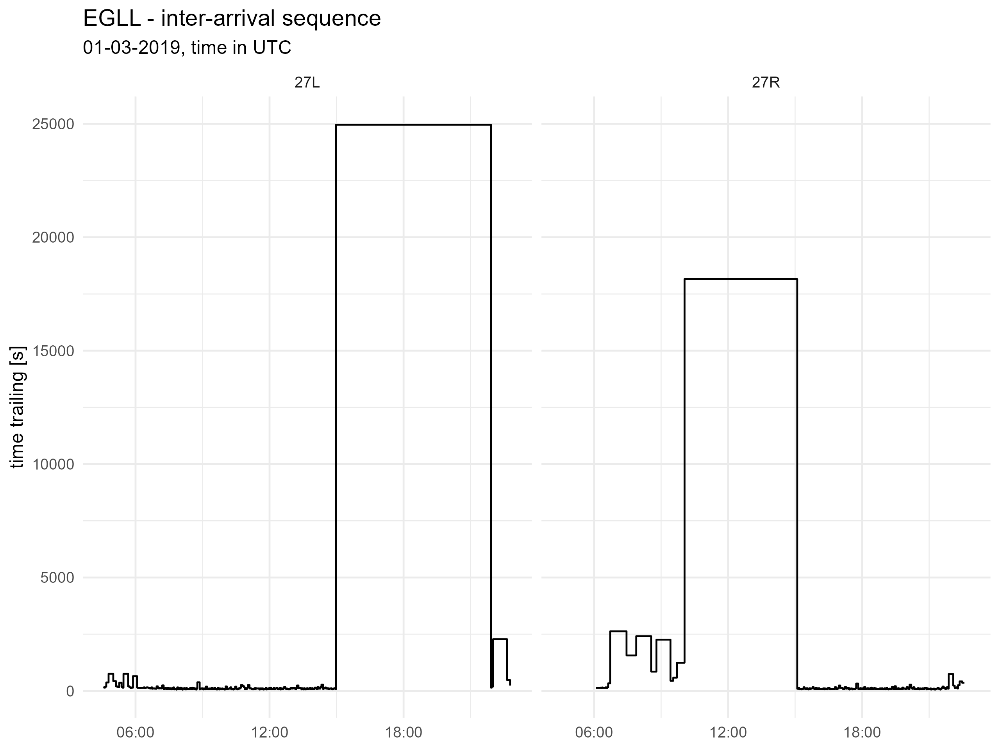
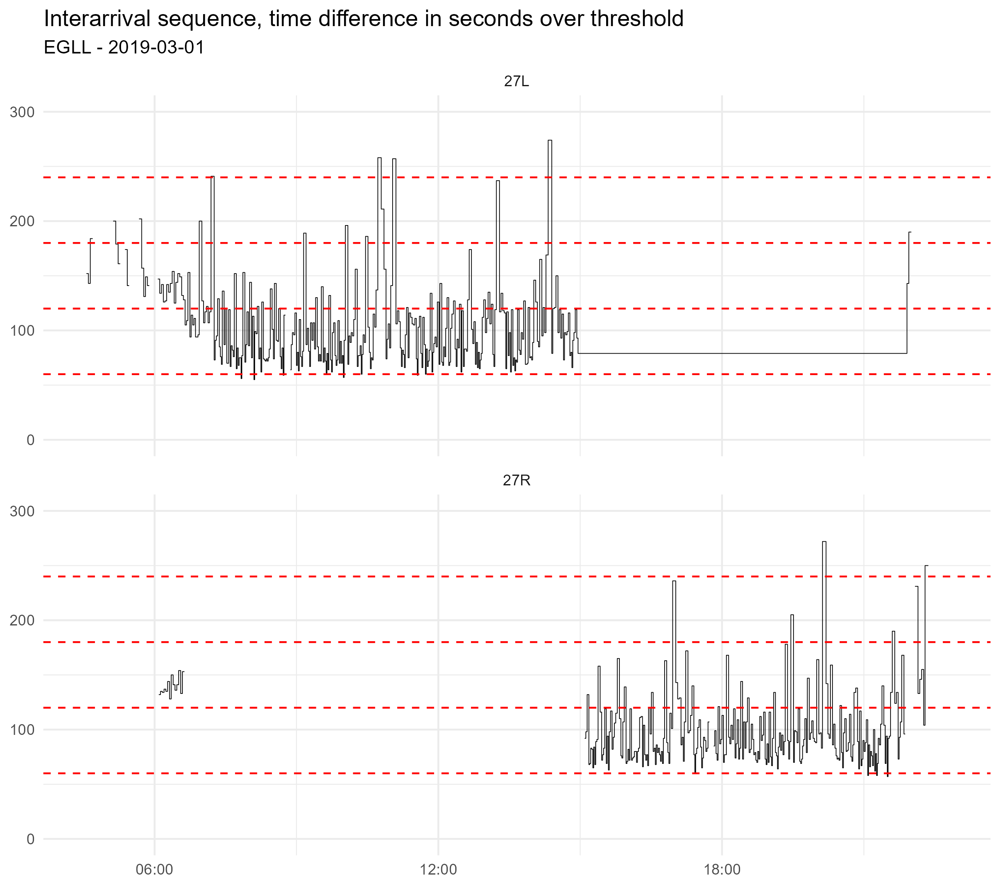
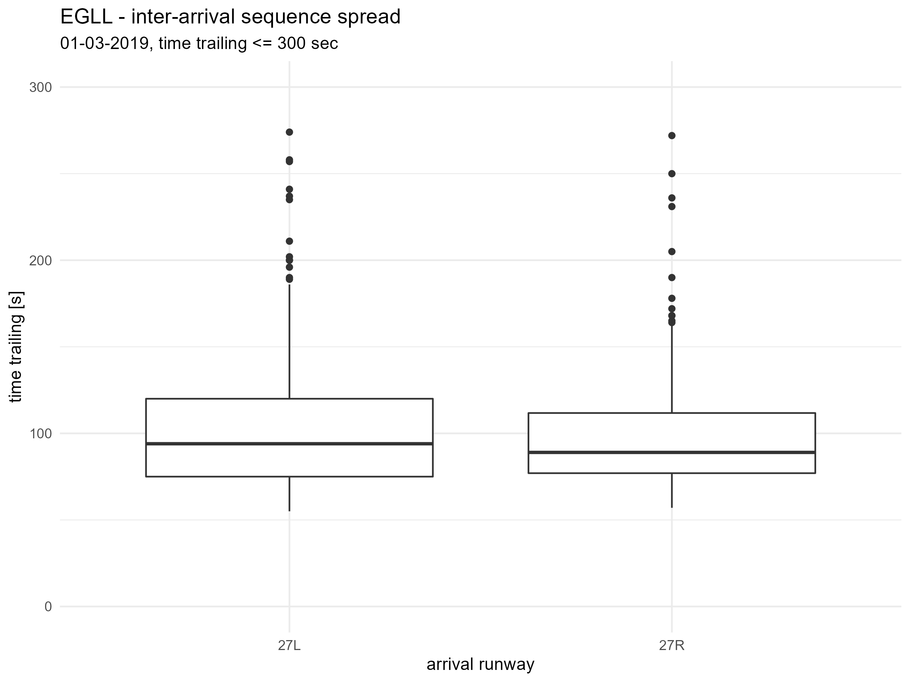
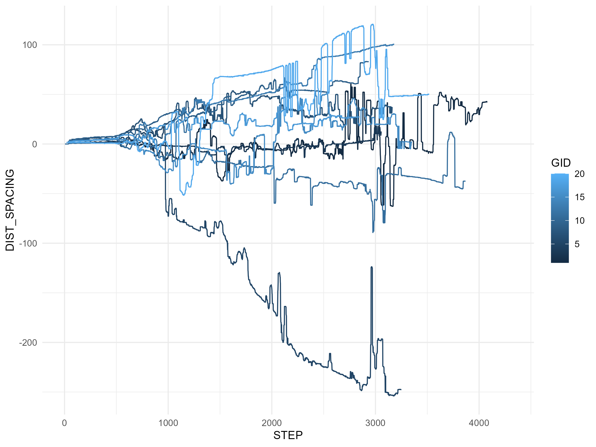

```{r setup, include=FALSE}
knitr::opts_chunk$set(echo = FALSE)
```

<!-- --------------------------------------------------------------------------
Outputs:
* PRC Briefing Paper/cover  deconflict Technical Note with stuff that cannot be published, i.e. “timeline” & attempts, selection of use-case
* (this) Technical Note
-------------------------------------------------------------------------   -->


# Introduction

## Overview

## Structure of this report

# Background
*	Trajectory management = core concept of operational concepts and future developments, strategic phase through operations
*	Arrival management = AMAN, extended AMAN
  +	Related concepts: runway pressure, classical vectoring/point merge, …. en-route delay absorption
*	Previous/existing work

<!-- -------------------- move to where it belongs & rewrite --------------- -->

recent research introduces the following:

**minimum time** --> reference flying time
* notion can be generalized to any point in the arrival airspace
* discretise the area in the form of a map of cells, each containing the minimum time from this cell to the final approach fix
* potential issue: does not guarantee a "global minimum" at every point which could influence the calculation of derived metrics (e.g. additional time, spacing deviation)
  + issue potential shortcuts, can be detemined with Dijkstra shortest past 
  + option/next steps: machine learning - trajectory clustering ~ associated "reference"

**Additional time**
Similarly to the minimum time, the notion of additional time of the PRU can also be generalized to any time for a given trajectory. It can simply be defined as the difference between the remaining flying time and the minimum flying time.    
The additional time represents the remaining delay to absorb: starting from the total amount of delay at the entry of the area and decreasing to zero at final point (a reversed definition could be considered, starting from zero and ending at the total delay).

** Spacing Deviation**    

The definition of spacing we propose relies on the combination of two existing notions: the minimum time introduced earlier and the constant time delay introduced by NASA for airborne spacing applications [13][14]. The constant time delay was introduced to define a spacing deviation with aircraft following same trajectories; it is based on the past positions of the leader aircraft with a given time delay corresponding to the required spacing. This notion can be generalised to any aircraft trajectories.
Let us consider a pair of consecutive landing aircraft denoted leader and trailer, with s their required time spacing1. Using the constant time delay principle, the spacing deviation (or spacing error) at time t considers the current position of trailer at time t, and the past position of leader at time t – s. Precisely, it is defined as the difference between the respective minimum times from these two positions (see figure below):
spacing deviation (t) = min time (trailer (t)) –
min time (leader (t – s))
This defines a spacing deviation at all times, with no assumption regarding aircraft path/navigation: aircraft may be following same or predefined trajectories, or may be on open vectors.

this concept can be expressed as
follows: let dtrail and dlead be the distances from the
current position of the aircraft to the waypoint.
When the leader reaches the waypoint (dlead=0), the
spacing error is the difference between the
remaining distance of the trailing aircraft to the
waypoint and the desired spacing:
d_error = d_trail_|(dlead = 0) - d_spacing

taking into account the desired spacing:
d_error = d_trail - d_lead - d_spacing

<!-- --------------------- END TO BE MOVED AND REWRITTEN ------------------- -->

# Conceptual Model (could be section of Method)

*	“performance measurement” – performance objectives
*	Geo-spatial ASMA concept  ~ efficiency := delta (actual travel time/distance – reference travel/distance)
*	Leader/follower vs need to space
*	Smoothing and congestion
*	Runway pressure vs threshold demand (use throughput vs US threshold)


# Materials and Methods

*	Potential data sources / short comings: 
  +	APDF – nope limited to milestones & exclusive temporal assessment, 
  + NM model 3 – okish, however, previous / current work on VFE show-cases limitations --> desire to have higher fidelity trajectory
  + Open-data trajectory
*	Other data sources used for the validation of the open 
*	Data preparation/workflow


## Study Data

This study builds on data collected by Opensky Network (https://opensky-network.org/). 
The Opensky Network community operates a sensor network of more than 3000 receivers across the globe [3]. 
The crowdsourced data collected by Opensky Network is available to research, non-profit and government organisations

The data was downloaded from Opensky Network making use of the traffic library [21]. 
The library supports the targeted extraction of trajectories landing and departing from the chosen airports.

<!-- validity check with APDF and flight numbers for study airports? -->

For the collection of ADS-B data and the extraction of arrival runway (RWY) and landing time, we used the traffic Python library [21]. <!-- IS THIS CORRECT? you crunched runways with R/RStudio -->

The traffic library converts the data from OSN to structures wrapping pandas data frames. 
For the processing of these data frames it provides specialised semantics for aircraft trajectories (e.g., intersection, re-sampling or filtering). 
Given an ICAO 24-bit identifier, it iterates over trajectories based on contiguous timestamps of data reports.

(ref:example-download) Example of extracting trajectory data from Opensky Network using the
Python traffic library

Figure \@ref(fig:example-download) shows the code to download one day of traffic departures from and arrivals to EGLL. 
It keeps only portions within 200 NM from the airport and resamples each trajectory at 1 second before storing in a file.

```{r example-download, fig.cap='(ref:example-download)', fig.align = 'center', out.width="70%"}

```

Reading in one day of data, e.g. 1. March 2019 for Heathrow (EGLL) provides the following data set:

<!-- 
Rows: 2,834,286
Columns: 24
$ timestamp       <dttm> 2019-03-01 05:19:53, 2019-03-01 05:19:54, 2019-03-01 05:19:55,~
$ alert           <dbl> 0, 0, 0, 0, 0, 0, 0, 0, 0, 0, 0, 0, 0, 0, 0, 0, 0, 0, 0, 0, 0, ~
$ altitude        <dbl> 40000, 40000, 40000, 40000, 40000, 40000, 40000, 40000, 40000, ~
$ callsign        <chr> "SAA234", "SAA234", "SAA234", "SAA234", "SAA234", "SAA234", "SA~
$ day             <dttm> 2019-03-01, 2019-03-01, 2019-03-01, 2019-03-01, 2019-03-01, 20~
$ destination     <chr> "EGLL", "EGLL", "EGLL", "EGLL", "EGLL", "EGLL", "EGLL", "EGLL",~
$ firstseen       <dttm> 2019-02-28 19:09:12, 2019-02-28 19:09:12, 2019-02-28 19:09:12,~
$ geoaltitude     <dbl> 39775, 39775, 39775, 39775, 39775, 39775, 39775, 39775, 39775, ~
$ groundspeed     <dbl> 410, 410, 410, 410, 410, 410, 410, 410, 410, 410, 410, 410, 410~
$ hour            <dttm> 2019-03-01 05:00:00, 2019-03-01 05:00:00, 2019-03-01 05:00:00,~
$ icao24          <chr> "00b1fa", "00b1fa", "00b1fa", "00b1fa", "00b1fa", "00b1fa", "00~
$ lastseen        <dttm> 2019-03-01 06:11:21, 2019-03-01 06:11:21, 2019-03-01 06:11:21,~
$ latitude        <dbl> 48.86239, 48.86394, 48.86551, 48.86775, 48.86929, 48.87122, 48.~
$ longitude       <dbl> 2.761182, 2.760104, 2.759086, 2.757568, 2.756512, 2.755244, 2.7~
$ onground        <dbl> 0, 0, 0, 0, 0, 0, 0, 0, 0, 0, 0, 0, 0, 0, 0, 0, 0, 0, 0, 0, 0, ~
$ origin          <chr> "FAGM", "FAGM", "FAGM", "FAGM", "FAGM", "FAGM", "FAGM", "FAGM",~
$ spi             <dbl> 0, 0, 0, 0, 0, 0, 0, 0, 0, 0, 0, 0, 0, 0, 0, 0, 0, 0, 0, 0, 0, ~
$ squawk          <chr> "6754", "6754", "6754", "6754", "6754", "6754", "6754", "6754",~
$ track           <dbl> 336.1226, 336.1226, 336.1226, 336.1226, 336.1226, 336.1226, 336~
$ vertical_rate   <dbl> 0, 0, 64, 0, 0, 0, 0, 0, 64, 64, 0, 0, 0, 0, 0, 0, 64, 64, 64, ~
$ track_unwrapped <dbl> 336.1226, 336.1226, 336.1226, 336.1226, 336.1226, 336.1226, 336~
$ start           <dttm> 2019-03-01 03:53:51, 2019-03-01 03:53:51, 2019-03-01 03:53:51,~
$ stop            <dttm> 2019-03-01 06:11:21, 2019-03-01 06:11:21, 2019-03-01 06:11:21,~
$ distance        <dbl> 199.9605, 199.8608, 199.7612, 199.6180, 199.5187, 199.3964, 199~
-->

(ref:osn-example) Input data example - Opensky-Network and Traffic library

```{r osn-example, fig.cap='(ref:osn-example)', fig.align = 'center', out.width="70%"}

```

Fig. \@ref(fig:osn-example) shows a snapshot of the trajectory data extracted from Opensky-Network.
The *Traffic* library supports the extraction of these position data points providing utilities for data pre-processing.
Next to the fields track_unwrapped and distance the data elements reflect the state vector positions associated to a flight.
For the purpose of this study the key fields are:

* ....

## Inter-arrival Sequences

(ref:EGLL-seq-00) EGLL - inter-arrival sequence - all day

```{r EGLL-seq-00, fig.cap='(ref:EGLL-seq-00)', fig.align = 'center', out.width="70%"}

```

(ref:EGLL-seq-01) EGLL - inter-arrival sequence - cut-off threshold identification

```{r EGLL-seq-01, fig.cap='(ref:EGLL-seq-01)', fig.align = 'center', out.width="70%"}

```

(ref:EGLL-seq-box) EGLL - inter-arrival sequence - cut-off threshold identification

```{r EGLL-seq-box, fig.cap='(ref:EGLL-seq-box)', fig.align = 'center', out.width="70%"}

```


## Spacing Deviation

(ref:EGLL-spacedev) EGLL - spacing deviation - example 20 flights

```{r EGLL-spacedev, fig.cap='(ref:EGLL-spacedev)', fig.align = 'center', out.width="70%"}

```

Fig, \@ref(fig:EGLL-spacedev) shows an example of the development of the spacing deviation of 20 random arrival flights. 
<!-- ---------------- USE-CASE ANALYSIS - RESULTS--------------------------- -->

# Use-Case Analysis

*	Discussion of limitations and/or set-up <----> check again with Theo whether we can get some data on “spaced flights”; check with SDM (also US/EU)
*	Use-case description; motivate timeframe and chosen airports
* Exploratory steps
  + Spacing heatmap
  + ASMA holding time/NMs vs throughput – peak/non-peak
* Tbd
  + “results” / use-case observations & discussion

* Towards a spacing metric
  + Potential proposal for (a) metric(s) to measure performance objectives


<!-- ---------------- FUTURE WORK ------------------------------------------ -->

# Future Work

## Methodology

### tbd

### Tesselation

The application of the additional time/distance concept is based on the tesselation of the airspace volume around the arrival airport. The associated reference flying times/distances to the threshold are built based on the observed data.

### Sequencing

This initial implementation focusses on inter-arrival sequencing. 
Conceptually, this reflects single-mode operations, and may thus ignore arrival-departure-arrival sequences.

The selected set of airports are characterised by either single-mode runway operations or strong arrival banks.
In that respect a potential higher cut-off threshold can include intermixed departures.
The latter becomes more relevant for aerodromes with mixed mode operations.

Future validation work should also address 

* cut-off value 
* intermixed departures - accounting for the start of the take-off roll and clearing of the runway of a potential preceeding departure.


## Data - Data Processing

This study demonstrates the general feasibility of the approach.
As part of the **Reference Trajectory** project of PRU, high fidelity data of Opensky-Network has been used for this study.

The current set-up is a limitation.     
Given the chosen range of 200NM the data pro-processing step is prohibitive for large-scale application at the time being. 
The download duration and extraction of the desired trajectory for a single day ranges between 4-7 hours.

As a potential work-around it is foreseen to evaluate the use of the lower fidelity data from NM for the initial stage of the assessment horizon (e.g. 100-200NM).    
This might introduce higher levels of uncertainty about the applied sequencing methods and travelled distances.


## Conclusions

### Overview and major findings

*	Demonstration of feasibility – general feasibility and trajectory processing and data analytical capability
o	Think about marketing open perf. Trajectory: This study falls into the wider scope of establishing open performance trajectory & flight table 
*	Capability – whatever we do ~ operational performance monitoring will build on trajectory data/capability; potential use for FE CAP, SAF
*	ENV = operational excellence = less fuel burn/CO2 (and non-CO2 GHG)

###	Limitations

*	This Technical Note summarises the approach, data-preparatory steps, and initial analysis on the basis of a use-case --> findings need to be validated on a wider sample 
*	Capability vs processing power

###	Next steps

*	Technical Implementation: “move away from desktop research” (processing power/capability ~ data volume): ref trajectory, processing modules, data analytics D+1
*	Technical Validation
  +	Expansion of use-case airports
  +	Validation of approach in the context of joint work with US FAA/ATO; input to US/EU, ICAO GIPEG, and multi-national benchmarking.
*	Operational Validation
*	Consultation with SJU/SDM, tracking of demonstration projects and/or deployment
*	Consultation with operational experts 

###	Further research

* interplay synchronisation and traffic flow management; application of machine-learning techniques


This use-case study aimed at establishing a prototype for the assessment of performance benefits of trajectory-based operations for the arrival (flow) management. 

The study kicks off identifying associated performance objectives and develops the concept of spacing deviation and sequencing effort. These concepts are developed on the basis of the operational concept and on-going research and further developed towards a first performance metric.

* what was done >>>>>>>>>

* benefits of approach >>>>>>>>>>

* drawback/weaknesses >>>>>>>>>

The previous section identified a series of next steps. 
These steps revolve around refining the data preparation and data-analytical process.
A key take-away is the further validation of the approach and performance metric algorithm.
The latter is planned to be conducted under the umbrella of the US/EU Study.
There is room to also engage in a stakeholder dialogue with a subset of service providers based on previous deployment of novel arrival techniques/concepts.

<!-- note: address some stakeholder complaints about ASMA -->

This work is also an input to the wider Open Data Initiative of the PRC and the **Open Flight Table and Reference Trajectory** project.
It is planned to package the associated software / analytical modules as Open Software to enable other researchers and interested experts to reproduce and verify the findings of this study and support the further development of the approach.

The work may be also included in the performance framework of the EUROCONTROL Performance Review System upon PRC approval.
