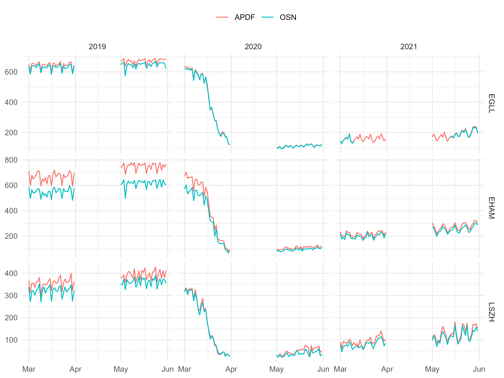

```{r setup, include=FALSE}
knitr::opts_chunk$set(echo = TRUE)
```

# Introduction

<!--| 1. Nature of the problem. -->

<!-- 2. Background of previous work - High-level background/driver of work. -->

The COVID19 pandemic shifted the focus and attention of political decision-makers and strategic planers over the past year. The unprecedented decline of regional and international air traffic poses challenges in terms of funding in terms of air traffic management modernization. While it is unclear how today's travel constraints and the vaccine roll-out will play out, both airspace users and air traffic service providers are committed to "build back better". This will include a higher emphasis on operational excellence. Higher levels of operational efficiency are considered to be enablers for reduced queueing, both in the airspace and on the ground, and lower associated fuel burn and emissions. It will be essential to ensure that with increasing traffic levels, inefficiencies are immediately tracked and remedied.

<!-- 3. Purpose and significance of the paper.   -->

Air transportation services are by definition an information rich environment. However, today, the access and availability of open data for the monitoring and validation of published results is limited. This paper addresses investigates how existing open data sources can be used to assess the current air transportation system performance, and trace the development of the performance levels with returning traffic demand.

<!-- 4. Method by which the problem is approached.  -->

The paper follows a data-driven approach. Based on the operational performance indicators promoted by ICAO, a performance monitoring toolset will be developed based on open air transport data. The public availability of the data in a near real-time set-up will ensure that independent validation of observed operational performance is available to policy makers and strategic planners. A novel traffic synchronization oriented performance metric will be developed. The metric aims to isolate operational and airspace related dimensions or inefficiencies. The approach will be presented as use-case analysis of four European airports that show significant differences in traffic patterns and approach concepts. The analysis of the arrival management techniques will support the evaluation of the achieved performance levels in terms of ground-based or airspace holding/queueing and delay absorption.

<!-- 5. Organization of the paper. -->

The contribution of this paper are as follows:

-   

-   

-   

# Background

## COVID19 and Air Transportation

On March 11, 2020, the World Health Organisation has declared the novel coronavirus (COVID19) outbreak a global pandemic. Communicable disease control resulted in massive restrictions on international and regional air traffic and passenger travel. The unprecedented decline in air traffic demand resulted in severe financial strains on the air transport industry. The financial support or lack thereof for airlines and airports has been widely covered in the media. A variety of studies showed the interplay or consequences of the travel constraints. To date, lower attention was given to the inherent change in terms of air transport services.

-   TODO - add figure of traffic decline and/or COVID19 surge (--\> OSN data set)

## Crowd-Sourced Open Data

A recent paper [@strohmeier_crowdsourced_2021] highlights the role of open data as a form of "citizen science". The benefits of lowering the barriers to access data and evaluate the benefits result in a "democratisation" through increased transparency.

# Materials and methods / System model / Conceptual Approach

## Operational Performance Monitoring

-   performance monitoring, KPIs, harmonisation effort through ICAO GANP

-   Europe, Performance Review System & publication of monitoring via ansperformance.eu

-   for this study set of performance indicators

    -   which indicators to use & limitations (snapshot measurement on timestamps)

## Measuring Arrival Flow

-   intro:

The overarching objective of air navigation is the "safe, efficient, and orderly flow of air traffic" (REF: ICAO). Airport operations on and within the vicinity of the airport pose a challenge. Arrival management aims at reducing the sequencing measures by air traffic controllers and reducing related procedural or tactical extension of the path. A reduction of such traffic sequencing operations leads to lower fuel consumptionm in unfavourable altitudes within the proximity of an aerodrome. Reduced fuel burn directly reduces emissions and contributes to lower noise. Streamlines arrival flows ensure further an increased usage of the available runway system capacity and airport operations.

-   arrival traffic flow characterisation, peak , "pressure" on runway system

-   time vs distance flown

## Analytical Approach and Data Requirements

-   describe trajectory basics, dedicated timestamps, and identification problems (e.g. runway)

-   develop analytical workflow/algorithm (cleaning & filtering \>\> segmentation \>\> rwy id \>\> ...)

    -   cross-reference to "grammar" of trajectory [@olive_traffic_2019]

## Study Data

This study builds on data collected by Opensky Network (<https://opensky-network.org/>). The Opensky Network community operates a sensor network of more than 3000 receivers across the globe [@strohmeier_crowdsourced_2021]. The crowdsourced data collected by Opensky Network is available to research, non-profit and government organisations. To support the on-going efforts with a view to COVID-19, the network provides a preprocessed data set of flight data. This data can be downloaded from CERN's Zenodo repository: <https://doi.org/10.5281/zenodo.3737101> [@xavier_olive_2021_4893103]. It provides global flight data covering January 2019 through today. This data set is used in XXX and supports the analysis of air traffic development pre-COVID-19, during COVID, and the current recovery.

FIG X is build from this flight dataset. XXXXXXXXXXXXXXX

For this study the lower level trajectory data is used. The data was downloaded from Opensky Network making use of the *traffic library* [@olive_traffic_2019]. The library supports the targeted extraction of trajectories landing and departing from the chosen airports. The respective trajectory data for March and May 2019, 2020, and 2021 was downloaded.

>TODO - ADD TABLE WITH data size for MAR/MAY 2019, 2020, and 2020

The validity of the data was checked by comparing the extracted data with the airport operator flow (APDF) of EUROCONTROL's Performance Review Unit. The APDF data [ref to data specs] is collected monthly in accordance with the associated data specification. The data is used for the regular performance monitoring under the EUROCONTROL Performance Review System and the European Sky Performance Scheme.

>TODO - comparison of APDF with OSN data - number of flights / any specifics.

(ref:apdf-timeline)APDF timeline for arrivals at the study airport

```{r apdf-timeline, fig.cap="(ref:apdf-timeline)"}

```

Figure \@ref(fig:apdf-timeline) shows SOMETHING ...


## Data

This study uses data from Opensky Network.
The project downloaded the associated flight tables for 3 major airports in Europe and 2 months.
With a view to the sharp decline in air traffic in March 2020 and an initial recovery in May, we chose these 2 months in 2019, 2020, and 2021.
This provides characteristics and comparable months and supports the idea of taking snapshots pre-COVID, during the traffic decline, and a year after this initial disruption.

The study data accounted for xx GB

<!-- add table airport - month - file size -->

During an initial data validation step the downloaded data was compared to the monthly performance data collected from European airports by the Performance Review Unit of EUROCONTROL.

>ADD COMPARISON WITH APDF AND LEVEL OF OVERLAP

# Results

## Overall Traffic / Demand Pattern

-   how far have we come, are we seeing traffic returning, expansion of runway system capacity (use of multiple runways. change of traffic pattern).

## Classical Performance Measure

-   ASMA 100NM/40NM/50NM

-   (vertical) FE

## Sequencing

## Something Fancy and New?

> make a scatter plot of aforementioned measures - something fancy?

# Conclusions

<!-- 1. What is shown by this work and its significance.  -->

<!-- review and structure better, move upwards if needed -->

The results have shown the principal feasibility of a data-driven open data based approach for performance monitoring of air transport. This enables the day-to-day evaluation of operational excellence in an open and transparent manner. Operational excellence and the impact of varying operational concepts or benefit of technological enablers will become immediately visible. This will allow a closer evaluation of performance benefits, change implementation, and careful tracking of inefficiencies with the anticipated steadily increasing traffic levels in a post-COVID world. The results will be used to inform the work of ICAO's global performance expert group with a view to help prioritizing concepts and capabilities of the airspace building blocks for building back better.

<!-- 2. Limitations and advantages.  -->

<!-- 3. Applications of the results. -->

<!-- 4. Recommendations for further work.  -->

# Acknowledgment {.unnumbered}

# References {.unnumbered}
